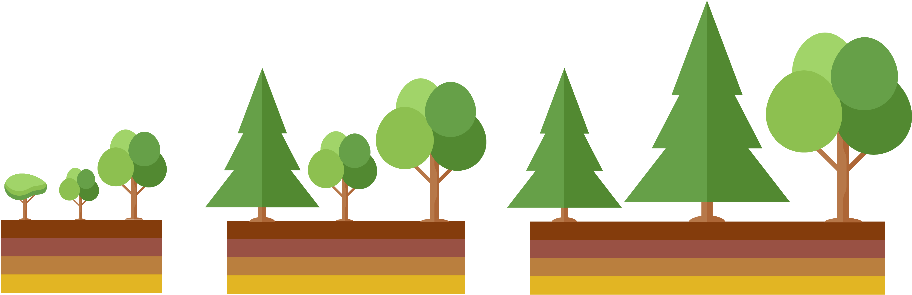
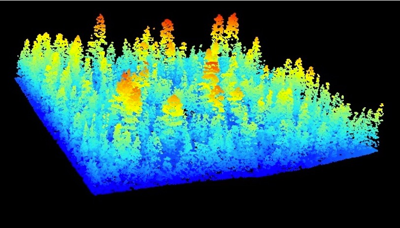

My current work involves testing and application of the Functionally Assembled Terrestrial
Ecosystem Simulator (FATES). FATES is an external module which can connect to a "host" land surface model. I currently implement FATES connected to NCAR's Community Land Model of the Community Terrestrial Systems Model (CLM-CTSM). 

FATES represents the biosphere as a division of land surface units into different succesional stages, or ages-since-disturbance (i.e. patches), which each contain various cohorts of plants grouped by height and plant functional type (PFT). These cohorts compete for above- and belowground resources and impact climate and their environment through biogeochemical feedbacks.

{: .mx-auto.d-block :}

For more information about FATES, see the [GitHub page](https://github.com/NGEET/fates).
 
 
## Applications within NEON network

I am currently working on applying FATES at several sites within the [National Ecological Observatory Network](https://www.neonscience.org/) (NEON). With FATES, we are necessarily in the business of capturing ecological processes across multiple scales, such as the cell-level processes of photosynthesis and transpiration, leaf-level processes like stomatal conductance and the impact on boundary layer dynamics, as well as tree and stand level processes like carbon allocation and competition for resources.

The NEON sampling design provides a way to benchmark FATES at these multiple scales through testing against flux observations, forest inventory data, and aerial remote sensing observations.

Specifically, I am working on initializing FATES with forest inventory and aerial remote sensing observations of forest species composition and structure. 

{: .mx-auto.d-block :}

Through initialization, we aim to improve simulations of current and future forest conditions at these sites.

