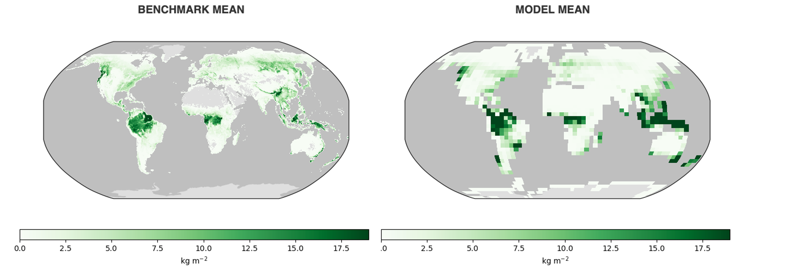
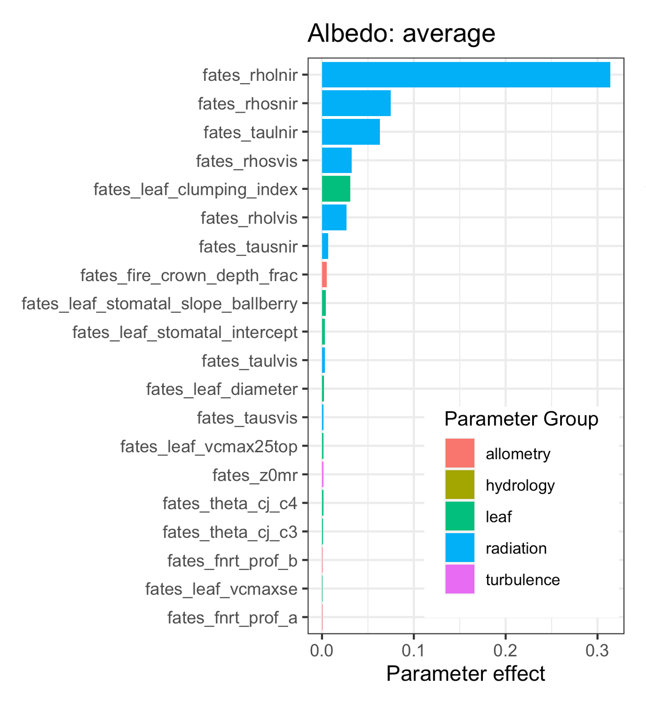

My current work involves testing and application of the Functionally Assembled Terrestrial
Ecosystem Simulator (FATES). FATES is an external module which can connect to a "host" land surface model. I currently implement FATES connected to NCAR's Community Land Model of the Community Terrestrial Systems Model (CLM-CTSM). 

FATES represents the biosphere as a division of land surface units into different succesional stages, or ages-since-disturbance (i.e. patches), which each contain various cohorts of plants grouped by height and plant functional type (PFT). These cohorts compete for above- and belowground resources and impact climate and their environment through biogeochemical feedbacks.

{: .mx-auto.d-block :}

For more information about FATES, see the [GitHub page](https://github.com/NGEET/fates).
 
 
## Applications within NEON network

I am currently working on applying FATES at several sites within the [National Ecological Observatory Network](https://www.neonscience.org/) (NEON). With FATES, we are necessarily in the business of capturing ecological processes across multiple scales, such as the cell-level processes of photosynthesis and transpiration, leaf-level processes like stomatal conductance and the impact on boundary layer dynamics, as well as tree and stand level processes like carbon allocation and competition for resources.

The NEON sampling design provides a way to benchmark FATES at these multiple scales through testing against flux observations, forest inventory data, and aerial remote sensing observations.

Specifically, I am working on initializing FATES with forest inventory and aerial remote sensing observations of forest species composition and structure. 

{: .mx-auto.d-block :}

Through initialization, we aim to improve simulations of current and future forest conditions at these sites. For more information about using FATES-CTSM at the NEON sites see the[ NCAR-NEON Community Collaboration page](https://www.neonscience.org/ncar-neon-community-collaborations).

## Global FATES Calibration

In collaboration with others at NCAR and other institutions, I am working to calibrate FATES globally using FATES' different [complexity modes](https://fates-users-guide.readthedocs.io/en/latest/user/Fixed-Biogeography-Mode.html). Because of FATES’ multi-scale nature, and the fact that these scales often interact non-linearly with one another, it can be very difficult to calibrate across all scales at once. 

{: .mx-auto.d-block :}

The different complexity modes of FATES allows us to hold these different processes constant while testing other parts of the model. For example, testing in FATES-Satellite Phenology model allows us to drill down into biophysical parameters while fixed biogeography mode allows us to test parts of the model that deal with competition and C allocation. The below figure shows the input parameters shown to be most impactful on simulated albedo in FATES-Satellite Phenology mode - we will calibrate these parameters (among others) in this mode.

{: .mx-auto.d-block :}

We aim to calibrate FATES in successively more complex modes, ultimately resulting in a robust global configuration of FATES.